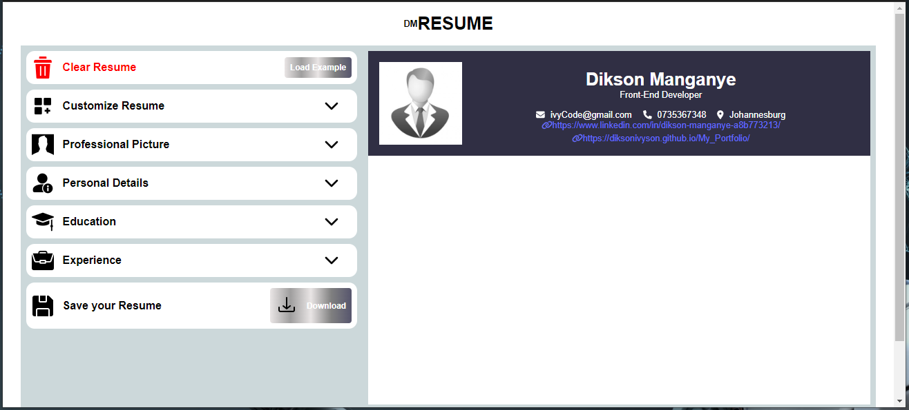

# dmResume

dmResume is a Resume Builder web app, which allows a user to build a resume from a template. dmResume offers a quick and easy way to create a professional resume from 3 design templates. Users can create a resume using the AI-powered online resume wizard, plus take advantage of expert suggestions and customizable modern and professional resume templates.

## Instructions and Usage

dmResume is a user-friendly web app that can be accessed from the web, hence it does not require any download. Users select and customize a template, then create a resume either with step-by-step guidance or by importing their LinkedIn profile. Users can add their experience, education, key skills, and more, aided by expert tips, suggested phrases, and an AI writer tool.
